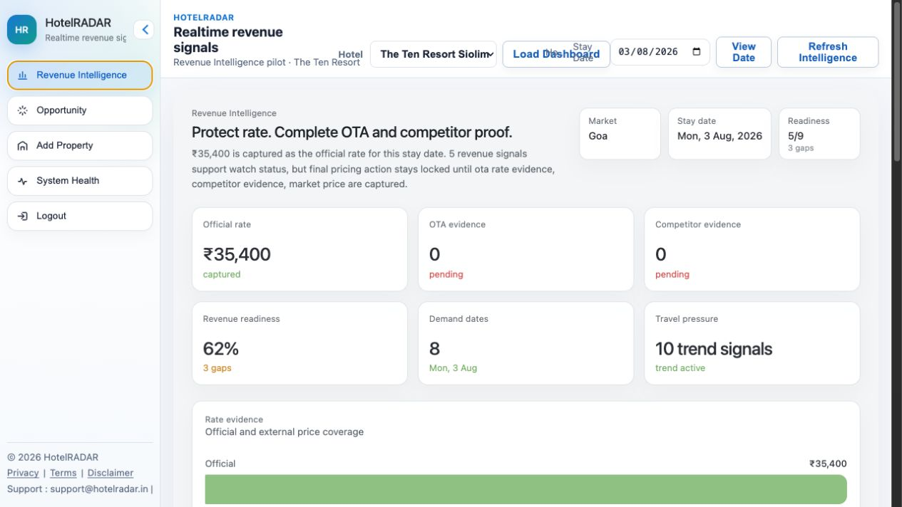
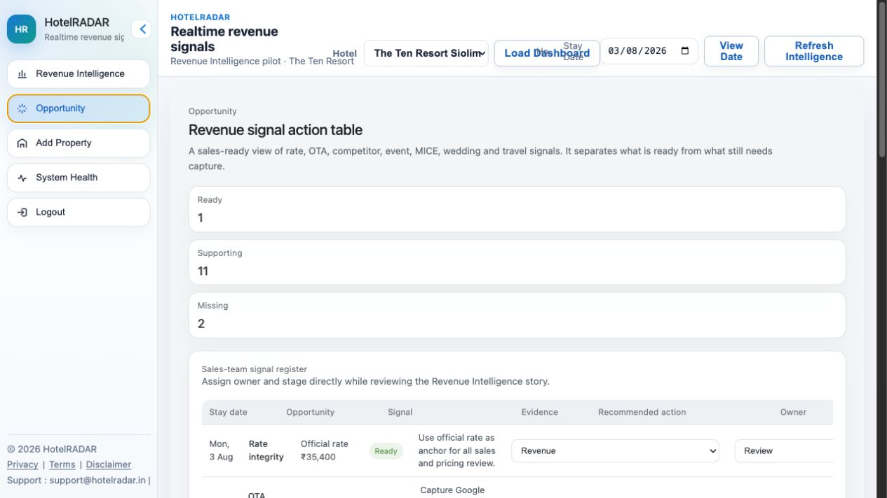
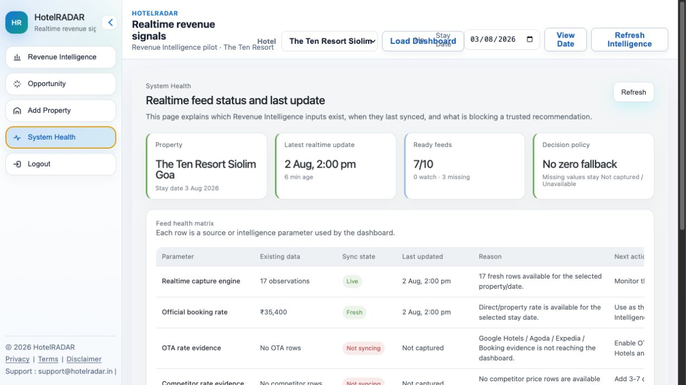
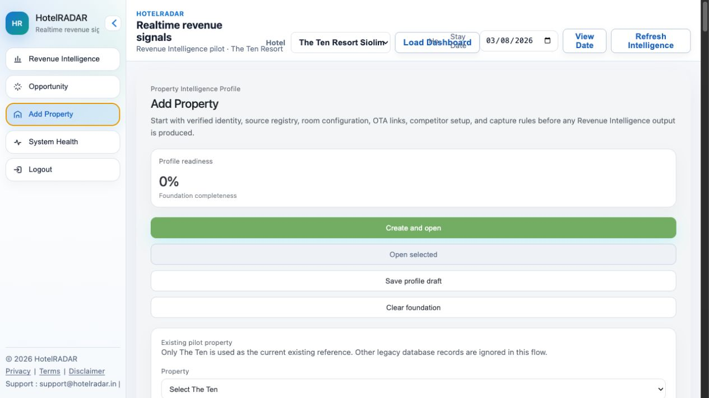

# HotelRADAR Realtime Market Intelligence Product Report

Audience: Research Intern
Version: 2026-08-02
System: HotelRADAR Revenue Intelligence
Pilot property: The Ten Resort Siolim Goa

> Security note: this report intentionally excludes passwords, API keys, server IPs, SSH details, database credentials, Cloudflare details, and any other operational secrets. Research interns should never store credentials in research notes, spreadsheets, screenshots, or source documents.

---

## 1. Executive Summary

HotelRADAR is being built as a subscription-based Revenue Intelligence product for hotels. Its purpose is to help a hotel general manager, revenue manager, owner, and sales team understand what is happening in their market before future stay dates and convert that understanding into confident commercial action.

The product should answer four questions for every important stay date:

1. What is happening in the market?
2. Why is it happening?
3. How does it affect this property?
4. What should the hotel do next?

The current system has moved from an experimental dashboard into a more stable product foundation. It now has:

- a Revenue Intelligence dashboard;
- an Add Property onboarding flow;
- a System Health page showing feed status and last update;
- an Opportunity page for sales/revenue follow-up;
- a Central Intelligence direction where pricing actions must come from verified evidence;
- a realtime signal observation table foundation;
- a pilot property focus on The Ten Resort Siolim Goa.

The next product phase is to make the platform genuinely live by turning each research/source area into a scheduled capture feed, validating every observation, and showing freshness, confidence, and missing evidence clearly.

---

## 2. Product Objective

HotelRADAR should become a market-aware Revenue Intelligence system for hotels.

It should not be a simple dashboard with random numbers. It should be a trustable decision support system that combines:

- official hotel rate;
- OTA price visibility;
- competitor pricing;
- market average and position;
- important stay dates;
- events and holidays;
- MICE/corporate demand;
- wedding/social group demand;
- travel and search pressure;
- freshness and data health;
- missing evidence;
- opportunity actions for sales teams.

The final client-facing output must be simple, but the intelligence behind it must be evidence-based.

Supported action vocabulary:

- Need More Data
- Hold / Watch
- Increase Watch
- Reduce Watch
- Increase
- Reduce
- Close Discount
- Minimum Stay
- Close Out

The product must never show fake certainty. If a required signal is missing, it should say so.

---

## 3. Current System Screenshots

These screenshots were captured from the live production system for documentation and research reference.

### 3.1 Revenue Intelligence Dashboard

Current purpose:

- Shows the executive Revenue Intelligence position.
- Separates ready, supporting, and missing evidence.
- Shows official rate, OTA evidence, competitor evidence, market price, event/holiday, travel pressure, MICE, wedding, and freshness.
- Prevents strong pricing recommendation when OTA, competitor, or market-price evidence is missing.

### 3.2 Opportunity Page

Current purpose:

- Converts intelligence gaps and demand signals into sales/revenue team tasks.
- Shows stay date, opportunity type, signal, evidence status, recommended action, owner, and stage.
- Helps the hotel team act on intelligence rather than only read analytics.

### 3.3 System Health Page

Current purpose:

- Shows whether feeds are live, fresh, missing, partial, or not syncing.
- Shows last updated time.
- Explains why a feed is blocked or incomplete.
- Protects product trust by making missing data visible.

### 3.4 Add Property Page

Current purpose:

- Captures the property profile and source registry.
- Defines source URLs, OTA links, competitor set, room/rate products, and commercial positioning.
- This page should become the control room for realtime capture configuration.

---

## 4. What We Have Created So Far

### 4.1 Revenue Intelligence Dashboard

The dashboard now presents a calmer, premium view instead of cluttered widgets. It focuses on:

- official rate;
- OTA evidence;
- competitor evidence;
- revenue readiness;
- demand dates;
- travel pressure;
- evidence mix;
- separated revenue signals.

Important product rule:

The dashboard must not manufacture pricing conclusions from incomplete evidence. If OTA and competitor evidence are missing, the system should not produce a confident price action.

### 4.2 System Health

System Health is the trust layer.

It tells the hotel:

- what data exists;
- when it last updated;
- whether a feed is syncing;
- why a feed is missing;
- what action is needed to repair the feed.

This is important because realtime products fail when users cannot understand whether the system is live or stale.

### 4.3 Opportunity

Opportunity is the action layer for hotel teams.

It turns intelligence into practical work:

- capture OTA rates;
- add competitor evidence;
- review market average;
- create direct booking package;
- prepare sales outreach;
- assign MICE/wedding leads;
- mark action stage.

This should eventually become a lightweight CRM-style table for hotel sales and revenue teams.

### 4.4 Add Property

Add Property is being repositioned from a simple hotel creation form into a source and capture registry.

It should store:

- official website;
- booking engine URL;
- Google Hotels URL;
- OTA URLs;
- competitor hotel URLs;
- source frequency;
- room/rate products;
- competitor rules;
- local market positioning;
- MICE/wedding/event sources.

### 4.5 Central Intelligence Direction

The system direction is to use one intelligence layer instead of many disconnected scoring systems.

Central Intelligence should:

- receive normalized inputs;
- check required evidence;
- calculate confidence;
- detect contradictions;
- apply freshness rules;
- lock strong actions when evidence is missing;
- return a final action and reason.

This avoids the problem of two intelligence systems producing nil, random, or contradictory outputs.

---

## 5. What We Are Trying To Achieve

HotelRADAR should become the hotel’s market command center.

For a busy hotel GM, the system should show:

- Are we priced correctly for upcoming dates?
- Are competitors moving?
- Are OTAs undercutting or exposing parity gaps?
- Is demand building because of holiday, event, wedding, MICE, airfare, or search trend?
- Which dates need protection?
- Which dates need sales action?
- Which signals are missing?
- Can I trust this recommendation?

The ideal future state:

For every property and stay date, HotelRADAR produces a clear confidence-backed action such as:

> “Hold / Watch. Official rate is captured, but OTA and competitor evidence are incomplete. Independence Day and travel search pressure are supporting demand, but strong price action is locked until fresh competitor proof exists.”

Or:

> “Increase Watch. Official rate, OTA evidence, competitor set, event pressure, and fresh observations are available. Demand pressure is rising for this stay date; prepare controlled rate increase and close weak discounts.”

---

## 6. Core Intelligence Modules

### 6.1 Hotel Intelligence

Purpose: understand the hotel’s own position.

Research/capture inputs:

- official rate by stay date;
- room type;
- occupancy;
- meal plan;
- cancellation rule;
- inventory availability;
- minimum stay;
- discounts/promotions;
- direct booking rate;
- booking engine proof URL;
- capture time.

Why it matters:

The hotel’s own rate is the anchor. Without own rate, price action cannot be trusted.

### 6.2 OTA Intelligence

Purpose: understand how the hotel appears on public booking channels.

Research/capture inputs:

- Google Hotels visible rate;
- Agoda rate;
- Booking.com rate where legally/technically accessible;
- Expedia rate;
- Hotels.com rate;
- MakeMyTrip/Goibibo rate;
- taxes/fees inclusion;
- room type;
- occupancy;
- cancellation rule;
- breakfast inclusion;
- mobile/member price indicator;
- proof URL and timestamp.

Why it matters:

OTA evidence shows rate parity, discount pressure, visibility, and public market position.

Important caution:

Some OTA APIs are partner-only. Where official partner access is unavailable, the system should use approved data providers, user-provided links, or consent-based capture instead of unsafe scraping.

### 6.3 Competitor Intelligence

Purpose: understand the comp set for the property.

Research/capture inputs:

- 3–7 comparable hotels;
- same micro-market;
- same category/positioning;
- distance from property;
- brand strength;
- review score;
- public price for same stay date;
- cancellation/breakfast/room comparability;
- source and proof timestamp.

Why it matters:

Competitor data lets HotelRADAR calculate market average, price position, and whether the hotel is underpriced or overpriced.

### 6.4 Event and Holiday Intelligence

Purpose: identify date-based demand pressure.

Research/capture inputs:

- national holidays;
- school holidays;
- long weekends;
- city events;
- concerts;
- sports;
- festivals;
- tourism events;
- government/local calendar events;
- distance from hotel;
- expected attendance where available;
- event category and rank.

Why it matters:

Events do not automatically mean price increase, but they create demand pressure that supports watch/increase signals when price evidence is also strong.

### 6.5 MICE / Corporate Intelligence

Purpose: detect corporate group demand and offsite movement.

Research/capture inputs:

- conferences;
- corporate offsites;
- exhibitions;
- summits;
- trade shows;
- business events;
- venue calendars;
- LinkedIn/event announcements;
- company offsite signals;
- destination corporate demand keywords.

Why it matters:

MICE can create room-night compression, especially for premium resorts, city hotels, and large inventory properties.

### 6.6 Wedding / Social Group Intelligence

Purpose: detect destination wedding and luxury group demand.

Research/capture inputs:

- wedding venues;
- banquet halls;
- wedding planner activity;
- social media signals;
- search demand;
- seasonal wedding calendar;
- auspicious dates;
- local venue availability;
- luxury/event hashtags.

Why it matters:

Wedding demand can drive suites, villas, group blocks, F&B revenue, and minimum-stay opportunities.

### 6.7 Travel and Search Pressure

Purpose: detect traveler attention and arrival pressure.

Research/capture inputs:

- Google Trends hotel/destination queries;
- Google Business Profile performance where the hotel authorizes access;
- flight search and airfare signals;
- airport arrival/flight capacity proxies;
- destination search growth;
- “hotels in Goa”, “Siolim resort”, “North Goa resort”, “wedding resort Goa”, etc.

Why it matters:

Search and travel pressure are supporting demand signals. They should not alone trigger price action, but they strengthen the story when price and competitor evidence exists.

### 6.8 Weather and Disruption Intelligence

Purpose: detect demand risk or opportunity due to weather.

Research/capture inputs:

- heavy rain;
- cyclone warnings;
- extreme heat;
- beach/weather suitability;
- flight disruption risk;
- road/travel disruption.

Why it matters:

Weather can reduce last-minute demand, increase cancellations, or create short-stay risk.

---

## 7. Permanent Data Source Plan

The system should use different data sources depending on hotel location, market type, and property category.

### 7.1 Property-Level Sources

Permanent sources:

- official hotel website;
- booking engine;
- PMS/channel manager feed where client authorizes access;
- Google Business Profile where client authorizes access;
- manual rate upload fallback.

Use for:

- official rate;
- direct booking availability;
- room type;
- inventory;
- booking pace;
- profile/search performance.

### 7.2 OTA and Public Price Sources

Preferred source hierarchy:

1. authorized PMS/channel manager/OTA partner connection;
2. approved third-party SERP/data provider;
3. manual proof URL capture;
4. browser-assisted internal capture where legally acceptable and rate-limited.

Potential source categories:

- Google Hotels via approved providers;
- Agoda public listing;
- Expedia / Hotels.com;
- Booking.com through partner/connectivity route where available;
- MakeMyTrip / Goibibo for Indian market relevance.

Research intern task:

For each hotel, identify source URLs and compare whether rates are visible for selected check-in/check-out dates. Do not use credentials or private accounts unless explicitly authorized.

### 7.3 Competitor Sources

Permanent sources:

- Google Hotels competitor cards;
- OTA competitor pages;
- competitor official websites;
- Google Maps profiles;
- review/rating sources;
- local market research.

Research intern task:

Build a comp-set file per property:

- competitor name;
- location;
- distance;
- category;
- why comparable;
- official URL;
- Google Hotels URL;
- OTA URLs;
- typical rate range;
- strengths/weaknesses.

### 7.4 Event Sources

Permanent sources:

- PredictHQ for structured demand/event intelligence;
- Ticketmaster Discovery API where market coverage exists;
- local tourism calendars;
- venue websites;
- government event calendars;
- local news/event sites;
- curated manual event list.

Research intern task:

For Goa, create monthly event calendars with:

- event name;
- date range;
- venue;
- city/micro-market;
- expected demand impact;
- distance from hotel;
- source URL;
- confidence.

### 7.5 Search and Travel Sources

Permanent sources:

- Google Trends API when available/approved;
- Google Custom Search for public web signal discovery;
- Google Business Profile Performance API for authorized hotel profile metrics;
- Amadeus or similar travel APIs for flight/travel indicators;
- airport schedule/capacity proxies where available.

Research intern task:

Build keyword sets by location:

- Goa hotel keywords;
- North Goa keywords;
- Siolim/Morjim/Assagao keywords;
- wedding resort keywords;
- MICE/corporate offsite keywords;
- luxury villa/resort keywords;
- Independence Day / Rakhi / long weekend keywords.

### 7.6 Weather Sources

Permanent sources:

- Open-Meteo or similar weather APIs;
- IMD/government alerts where available;
- local disruption/news feeds.

Research intern task:

Map weather parameters to hotel impact:

- beach leisure risk;
- flight delay risk;
- cancellation risk;
- weekend demand softness;
- monsoon package opportunity.

---

## 8. Location-Based Source Strategy

Data sources must be selected by hotel location, not copied blindly.

### 8.1 Goa / Resort Market

High priority:

- Google Hotels;
- Agoda;
- Expedia / Hotels.com;
- MakeMyTrip / Goibibo;
- official booking engine;
- competitor resorts;
- destination wedding sources;
- MICE/offsite sources;
- long weekend and holiday calendar;
- flight/search pressure;
- weather/monsoon signals.

Important micro-markets:

- Siolim;
- Morjim;
- Assagao;
- Anjuna;
- Vagator;
- Calangute;
- Candolim;
- Panjim;
- South Goa luxury belt.

### 8.2 Jaipur / Heritage and Wedding Market

High priority:

- wedding dates;
- palace/hotel competitor set;
- event venues;
- tourism seasonality;
- flight/search pressure;
- festival calendar;
- luxury group demand.

### 8.3 Mumbai / Business City Market

High priority:

- corporate events;
- exhibitions;
- convention centers;
- airport pressure;
- weekday compression;
- city events;
- competitor pricing near business districts.

---

## 9. Confidence and Decision Rules

Central Intelligence should use evidence gates before any strong action.

### 9.1 Confidence Bands

- below 40: Need More Data
- 40–59: Hold / Watch
- 60–74: Increase Watch or Reduce Watch only
- 75+: strong action only when all required evidence exists

### 9.2 Strong Action Requirements

Strong actions such as Increase, Reduce, Close Discount, Minimum Stay, or Close Out should require:

- own hotel rate;
- sufficient competitor evidence;
- sufficient OTA evidence;
- fresh observations;
- valid normalization;
- no critical data-health issue;
- no major contradiction.

### 9.3 Missing Data Rules

Missing numeric values must remain null.

They should render as:

- Not captured
- Unavailable
- Need More Data
- Not syncing
- Waiting for evidence

Never convert missing rate, market average, market position, or suggested price into zero.

### 9.4 Contradiction Rules

If evidence conflicts, confidence should reduce.

Examples:

- event pressure high but competitor prices unchanged;
- OTA rate missing but official rate exists;
- travel search rising but occupancy data weak;
- competitor rates high but hotel inventory abundant;
- stale observations used for fresh recommendation.

Contradiction should produce:

- Hold / Watch;
- explicit reason;
- required next evidence.

---

## 10. Algorithm Tweaks To Make The System Stronger

### 10.1 Freshness-Weighted Confidence

Do not treat all observations equally.

Suggested weighting:

- 0–2 hours old: full weight;
- 2–6 hours old: reduced weight;
- 6–24 hours old: supporting only;
- older than 24 hours: stale, not decision-grade.

### 10.2 Source Reliability Score

Each source should have a reliability score.

Example:

- official booking engine: high;
- authorized PMS/channel manager: high;
- Google Hotels provider: high/medium depending on provider;
- OTA public page: medium;
- search/news/social signal: supporting;
- manual entry: depends on proof.

### 10.3 Comparable Room Normalization

Rates must be normalized before market comparison.

Normalize by:

- occupancy;
- room category;
- breakfast/meal plan;
- cancellation rule;
- tax inclusion;
- length of stay;
- refundable vs non-refundable;
- member/mobile discount.

### 10.4 Micro-Market Weighting

Competitors closer to the property and similar in category should have higher weight.

Example:

- same micro-market + same category: high weight;
- nearby but different category: medium;
- same city but different segment: low.

### 10.5 Demand Pressure Stack

Event, wedding, MICE, airfare, search, and seasonality should be separate signals, not blended into a black-box score.

Dashboard should show:

- Ready
- Supporting
- Missing

This improves client trust because the hotel can see why a recommendation exists.

### 10.6 Opportunity Conversion

Every missing/active signal should create an Opportunity row.

Examples:

- OTA evidence missing → E-commerce action
- competitor evidence missing → Revenue action
- wedding signal active → Sales action
- MICE signal active → Corporate sales action
- long weekend active → pricing/package action

### 10.7 No Strong Action Without Proof

The system should prefer being conservative over being wrong.

If proof is incomplete:

- show Watch;
- explain missing evidence;
- create task;
- do not recommend aggressive price movement.

---

## 11. Research Intern Scope

The intern’s work is to help transform HotelRADAR from a dashboard into a live market intelligence engine.

The intern should not handle credentials, infrastructure, deployment, or private system access.

### 11.1 Research Workstream A: Property Source Registry

For each hotel:

- verify official website;
- find booking engine;
- find Google Hotels page;
- find OTA pages;
- identify visible room/rate products;
- record proof URLs;
- note if source is blocked, unavailable, or requires partner access.

Output format:

- hotel name;
- source type;
- source URL;
- room/rate visible;
- capture feasibility;
- notes;
- confidence.

### 11.2 Research Workstream B: Competitor Mapping

For each hotel:

- identify 3–7 comparable competitors;
- classify by micro-market;
- classify by category;
- document why each is comparable;
- collect public rate evidence for sample stay dates.

Output format:

- competitor name;
- URL;
- location;
- distance;
- category;
- comparable reason;
- rate evidence;
- confidence.

### 11.3 Research Workstream C: Event / Holiday Calendar

For each market:

- collect monthly holidays;
- long weekends;
- festivals;
- concerts/events;
- government/tourism events;
- sports/events;
- local venue events.

Output format:

- date;
- event name;
- source;
- expected impact;
- affected micro-markets;
- confidence.

### 11.4 Research Workstream D: MICE / Corporate Signals

For each market:

- identify conference venues;
- event halls;
- convention centers;
- corporate offsite venues;
- LinkedIn/public announcements;
- industry events.

Output format:

- event/company/source;
- date range;
- location;
- likely room-night impact;
- hotel relevance;
- confidence.

### 11.5 Research Workstream E: Wedding / Social Demand

For each resort/leisure market:

- identify wedding venues;
- wedding planners;
- popular wedding dates;
- social media/public web signals;
- destination wedding seasonality.

Output format:

- date/window;
- source;
- venue/market;
- demand impact;
- confidence.

### 11.6 Research Workstream F: Keyword and Search Taxonomy

For each market:

- define hotel search keywords;
- destination search keywords;
- wedding keywords;
- MICE/offsite keywords;
- long weekend keywords;
- family travel keywords;
- luxury resort keywords.

Output format:

- keyword;
- category;
- location;
- expected signal type;
- priority.

### 11.7 Research Workstream G: Marketplace Opportunity Intelligence

This workstream defines how market signals become practical hotel opportunities.

For HotelRADAR, an opportunity means a market signal or evidence gap that can lead to a revenue, sales, pricing, package, distribution, or risk action.

The intern should research and classify opportunity types across five buckets:

1. Revenue opportunities
   - increase rate watch;
   - close discount;
   - minimum stay;
   - protect BAR;
   - review OTA parity;
   - improve direct rate.

2. Sales opportunities
   - wedding group lead;
   - MICE/corporate offsite lead;
   - local event group business;
   - agent follow-up;
   - banquet/F&B opportunity.

3. Marketing opportunities
   - long weekend campaign;
   - family package;
   - monsoon offer;
   - search-demand campaign;
   - destination content push.

4. Distribution opportunities
   - OTA parity issue;
   - missing OTA visibility;
   - direct booking gap;
   - mobile/member discount conflict;
   - weak Google Hotels presence.

5. Risk opportunities
   - weather disruption;
   - stale competitor data;
   - low confidence;
   - cancellation pressure;
   - demand softness.

For each opportunity, the intern should capture:

- opportunity type;
- stay date or market window;
- signal behind it;
- evidence status;
- suggested hotel action;
- likely owner;
- urgency;
- missing proof;
- expected commercial impact;
- confidence.

Example:

Opportunity: Independence Day Long Weekend
Signal: Holiday + travel-search pressure active
Evidence: Supporting
Suggested action: Create 2-night direct package and monitor OTA/competitor rates
Owner: Revenue + Marketing
Deadline: 7 days before stay date
Confidence: 68%
Missing proof: Competitor rates not captured

---

## 12. Data Quality and Validation Rules

Every research item should pass these checks before entering the system:

1. Source exists.
2. Source URL is saved.
3. Date is clear.
4. Location is clear.
5. Hotel relevance is explained.
6. Data value is not guessed.
7. Confidence is assigned.
8. If rate data is used, occupancy/room/tax conditions are recorded.
9. If event data is used, venue and distance are recorded where possible.
10. If the source is weak, mark it as supporting only.

Do not enter:

- guessed rates;
- old screenshots without date;
- private credentials;
- personal data;
- unsupported claims;
- unverified social posts as strong evidence.

---

## 13. Realtime System Process

### Step 1: Add Property

Create or select property and configure:

- location;
- source URLs;
- OTA links;
- competitor set;
- room/rate products;
- capture rules.

### Step 2: Capture Feeds

Scheduled workers capture:

- official rate;
- OTA rates;
- competitor rates;
- events;
- MICE/wedding signals;
- travel/search pressure;
- weather/disruption.

### Step 3: Normalize Observations

Convert raw source data into common structure:

- source type;
- source name;
- stay date;
- numeric value;
- text value;
- proof URL;
- observed time;
- freshness expiry;
- confidence;
- metadata.

### Step 4: System Health

Every feed must show:

- last successful update;
- last failure;
- sync state;
- reason;
- next action.

### Step 5: Central Intelligence

Central Intelligence checks:

- evidence completeness;
- freshness;
- source reliability;
- contradictions;
- confidence band;
- final action vocabulary.

### Step 6: Dashboard

Dashboard presents:

- executive call;
- rate evidence;
- readiness;
- demand date chart;
- separated signals;
- missing evidence.

### Step 7: Opportunity

Opportunity table converts intelligence into action:

- owner;
- stage;
- recommended action;
- missing feed task;
- sales lead/task.

---

## 14. Recommended Build Roadmap

### Phase 1: The Ten Live Pilot

Goal: make one property fully live and trustworthy.

Tasks:

- finalize The Ten source registry;
- capture official booking-engine rate;
- integrate OTA rate feed;
- define 5–7 comp-set hotels;
- capture competitor prices;
- add August/September event dates;
- add wedding/MICE watch signals;
- enable auto-refresh dashboard;
- update System Health from real feed-run logs.

Success criteria:

- System Health shows all core feeds fresh;
- dashboard shows no fake zero values;
- OTA and competitor evidence exists;
- recommendations remain conservative when evidence is missing;
- Opportunity table shows actionable tasks.

### Phase 2: Goa Market Intelligence

Goal: build reusable Goa intelligence.

Tasks:

- source registry for all selected Goa pilot hotels;
- Goa competitor taxonomy;
- Goa holiday/event calendar;
- Goa wedding/MICE source list;
- travel/search keyword set;
- micro-market mapping.

### Phase 3: Multi-Property Expansion

Goal: allow each hotel to onboard and receive its own intelligence.

Tasks:

- support new property source registry;
- source health by property;
- comp-set creation workflow;
- research assistant import templates;
- data QA approval before live use.

### Phase 4: Predictive Intelligence

Goal: move from live signals to forward-looking confidence.

Tasks:

- historical rate/evidence archive;
- pickup and pace integration;
- event impact backtesting;
- forecast model;
- confidence calibration;
- explainable action recommendations.

---

## 15. Intern Research Deliverables

The research intern should produce:

1. Source registry spreadsheet for The Ten.
2. Comp-set research file for The Ten.
3. Goa August/September event and holiday calendar.
4. MICE/corporate source list for Goa.
5. Wedding/social demand source list for Goa.
6. OTA source feasibility notes.
7. Keyword taxonomy for Google Trends/search monitoring.
8. Marketplace opportunity taxonomy for revenue, sales, marketing, distribution, and risk.
9. Data quality notes: which sources are strong, weak, missing, or blocked.

Each deliverable should include:

- source URL;
- date captured;
- confidence;
- notes;
- whether it is ready for automation.

---

## 16. Recommended Database Concepts

The following system entities should exist or be strengthened:

- properties;
- property source registry;
- room/rate products;
- competitor set;
- realtime feed runs;
- realtime signal observations;
- event calendar;
- demand signals;
- opportunity actions;
- system health logs;
- central intelligence outputs;
- source reliability scores.

Important rule:

Observations should be immutable. If a new capture occurs, create a new observation row. Do not overwrite historical observations.

---

## 17. Source Reference Notes

These references were used to frame the datasource strategy. They are listed for research orientation only; any integration must be reviewed for access, terms, pricing, and compliance.

- Google Business Profile Performance API: https://developers.google.com/my-business/reference/performance/rest
- Google Custom Search JSON API: https://developers.google.com/custom-search/v1/overview
- Google Trends API alpha: https://developers.google.com/search/apis/trends
- Amadeus for Developers APIs: https://developers.amadeus.com/self-service/apis-docs/guides/developer-guides/
- Ticketmaster Discovery API: https://developer.ticketmaster.com/products-and-docs/apis/discovery-api/v2/
- PredictHQ Events API: https://docs.predicthq.com/api/events/search-events
- Open-Meteo Weather API: https://open-meteo.com/en/docs
- Booking.com Connectivity APIs: https://developers.booking.com/connectivity/docs
- SerpApi Google Hotels API: https://serpapi.com/google-hotels-api
- DataForSEO Google Hotels API: https://dataforseo.com/help-center/how-to-collect-prices-from-google-hotel-search

---

## 18. Final Product Principle

HotelRADAR should win trust by being honest.

If evidence is strong, the product should confidently recommend action.

If evidence is missing, the product should clearly say what is missing and create the next task.

The strongest version of HotelRADAR is not the one that gives the most aggressive recommendation. It is the one a hotel can trust before changing rates, closing discounts, setting minimum stay, or calling the sales team.
