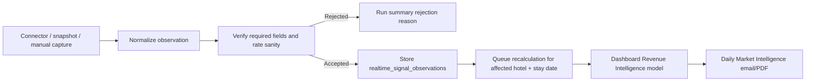

# Verified live data connector contract

HotelRADAR should treat every external feed as evidence, not truth by default.

The live-data connector layer is designed so future adapters can be added without creating duplicate scoring logic or unsafe dashboard claims.

## Connector objective

Every connector must return normalized observations that can answer:

- What was captured?
- Which hotel and stay date does it apply to?
- Which source produced it?
- Is there proof?
- When was it observed?
- When does it become stale?
- How confident are we allowed to be?

## Supported source types

- `official` — hotel direct / booking-engine rate
- `ota` — Agoda, Booking.com, Expedia, MakeMyTrip, Google Hotels OTA panel
- `competitor` — comparable hotel rate evidence
- `event` — holiday, festival, MICE, wedding, local demand event
- `search` — travel intent, Google Trends style demand pressure
- `airfare` — fare/flight movement
- `weather` — weather or disruption risk
- `pms` — pickup, occupancy, cancellation, lead time
- `digital` — website, booking-flow, metasearch, direct-channel audit
- `review` — review velocity and reputation movement
- `social` — social demand or campaign pressure
- `system` — internal freshness/diagnostic signal

## Verification rules

Rate evidence is only accepted when the numeric rate is positive. Missing or zero rates are rejected, not stored as `0`.

Rate evidence without proof URL can be stored only as `needs_proof`. Its confidence is capped so it can support the story but should not unlock strong pricing action by itself.

Rows with missing hotel, city, source name, stay date, or positive rate value are rejected.

Each accepted row receives:

- `verificationStatus`: `verified` or `needs_proof`
- `sourceReliability`
- `sourceTrustScore`
- `verificationReasons`
- `connectorName`

## Capture flow



## Registering a connector source

Use the CLI after the source has a proof-manifest URL or a server-side manifest file.

Official booking-engine manifest example:

```bash
npm run sources:register -- \
  --hotel-id <hotel_uuid> \
  --city Goa \
  --source-type official \
  --source-name "The Ten booking engine" \
  --adapter-type official_rate_manifest \
  --source-url "/opt/radar_light/shared/live_sources/the-ten-official-rates.json" \
  --proof-required true \
  --freshness-minutes 240 \
  --cadence-minutes 60
```

OTA / Google Hotels proof manifest example:

```bash
npm run sources:register -- \
  --hotel-id <hotel_uuid> \
  --city Goa \
  --source-type ota \
  --source-name "Google Hotels proof manifest" \
  --adapter-type google_hotels_manifest \
  --source-url "/opt/radar_light/shared/live_sources/the-ten-google-hotels.json" \
  --proof-required true \
  --freshness-minutes 120 \
  --cadence-minutes 60
```

Manifest shape:

```json
{
  "rows": [
    {
      "checkin_date": "2026-08-16",
      "source_name": "Agoda",
      "source_type": "ota",
      "signal_type": "ota_rate",
      "rate": 35400,
      "proof_url": "https://example.com/proof",
      "observed_at": "2026-08-15T04:00:00.000Z"
    }
  ]
}
```

## Recommended permanent connectors

Phase 1 — current foundation:

- Manual verified snapshot import
- Existing hotel/competitor rate mirror
- City event mirror
- MICE/wedding classification through event metadata
- Search-intent signal classification

Phase 2 — next live adapters:

- Official booking engine adapter per onboarded hotel
- Google Hotels / OTA evidence adapter with screenshot/proof URL
- Competitor comp-set adapter with room-type normalization
- Google Trends / travel search connector by city and stay window
- Weather/risk connector by location

Phase 3 — commercial intelligence:

- PMS pickup, occupancy, cancellation, lead time
- Review velocity and Google Business Profile movement
- Website booking-flow and direct-rate visibility
- Wedding/MICE venue watch and enquiry pipeline
- Sales opportunity feed from verified demand windows

## Product rule

Connectors do not make final pricing decisions.

They only produce verified or guarded evidence. Central Revenue Intelligence decides whether the output is:

- Need More Data
- Hold / Watch
- Increase Watch
- Reduce Watch
- Increase
- Reduce
- Close Discount
- Minimum Stay
- Close Out
